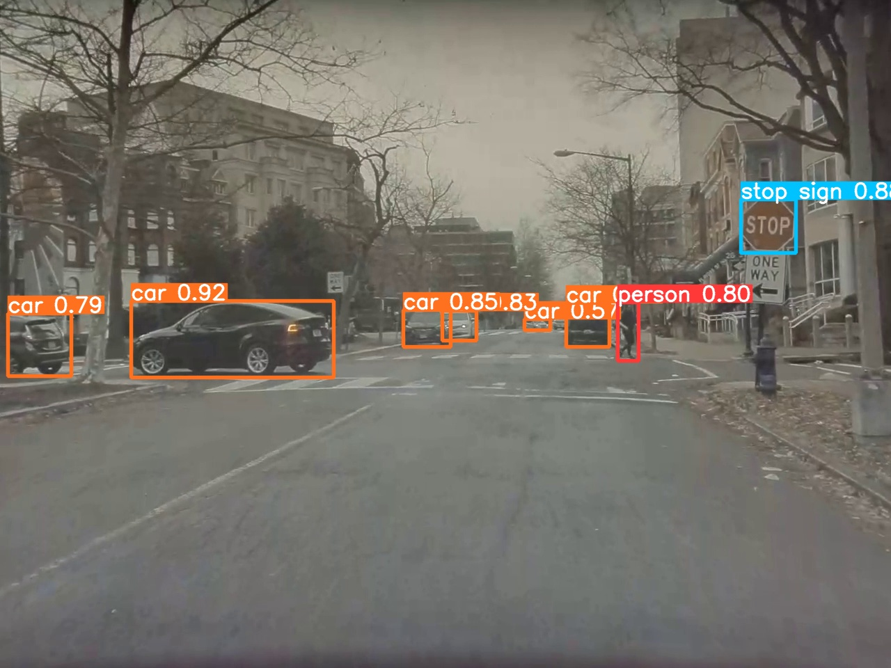
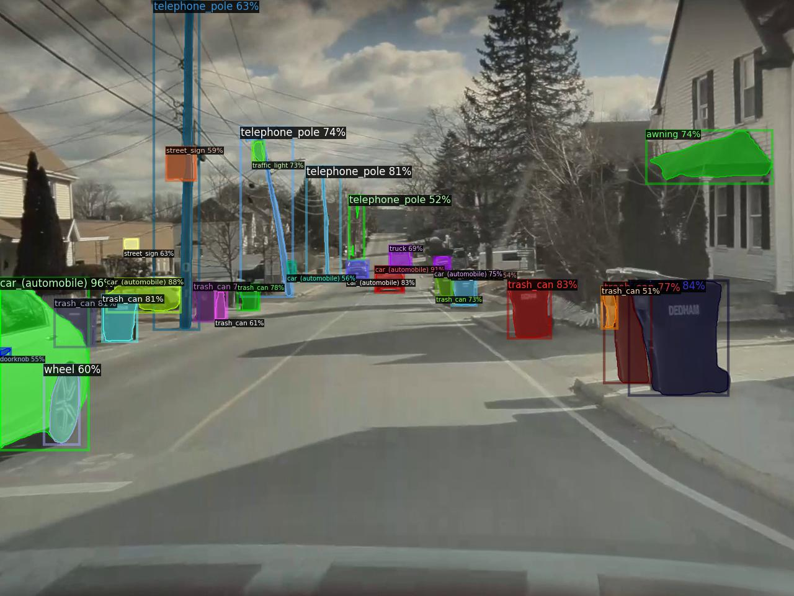
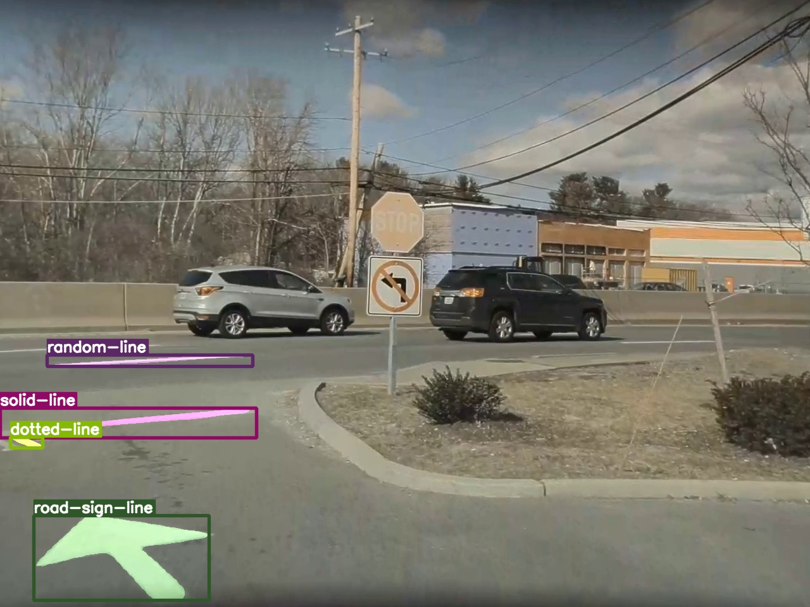
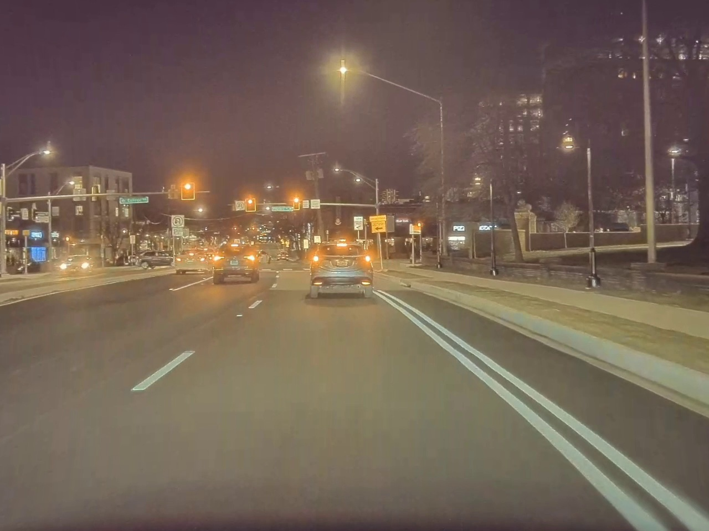
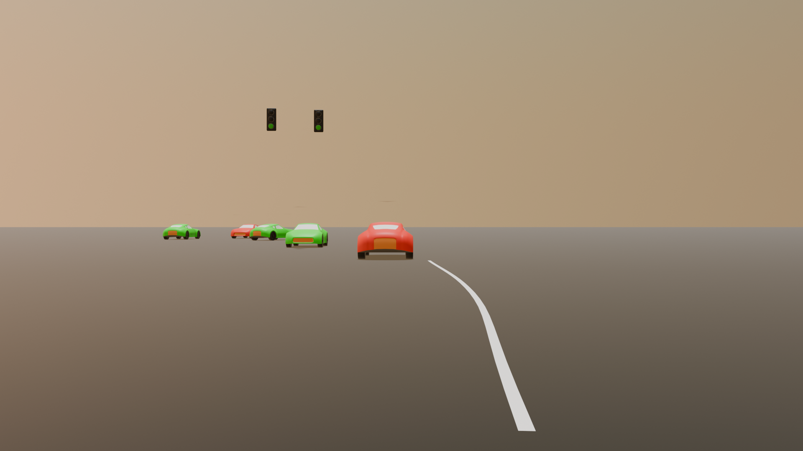
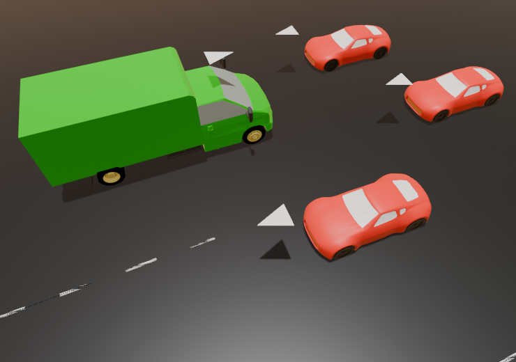
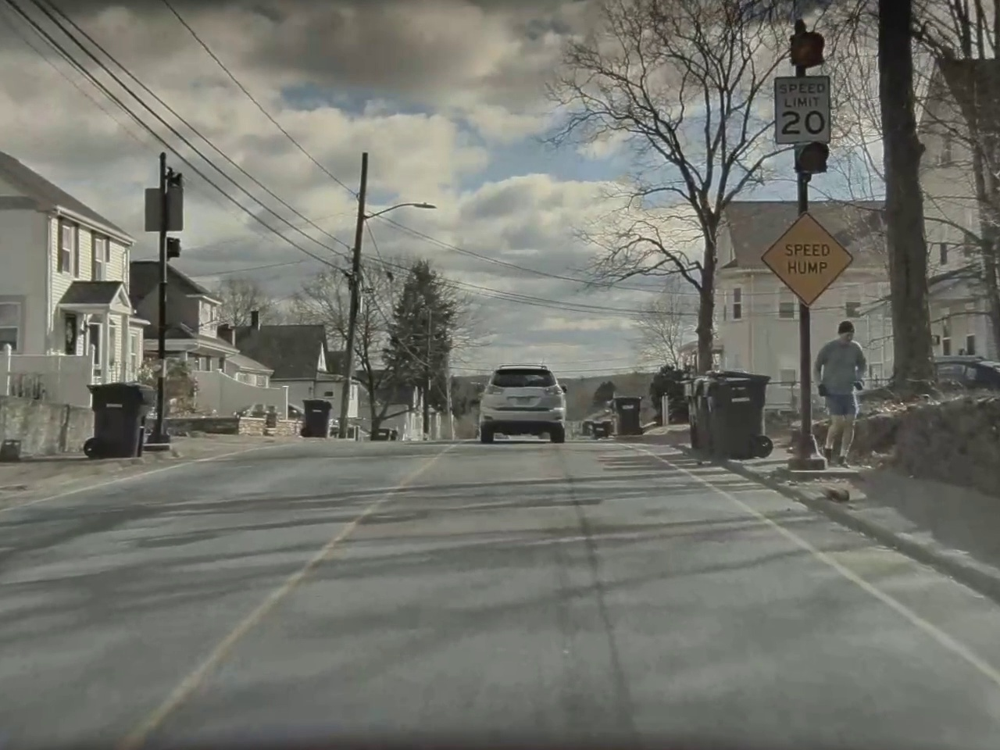
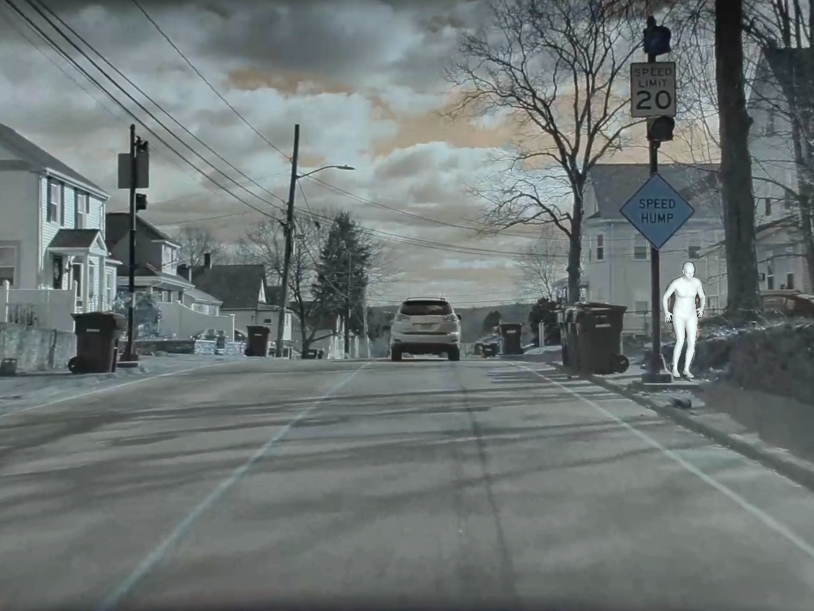
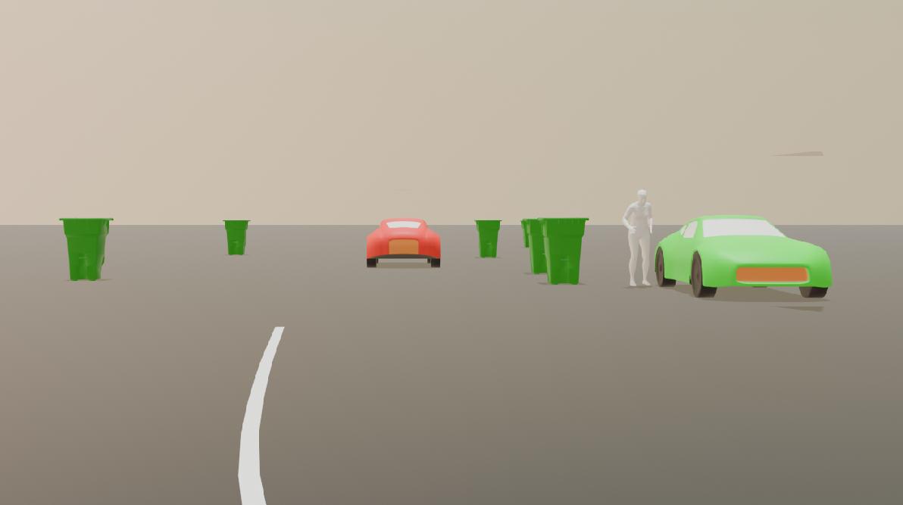

# Traffic Scene Inference and Rendering

An end-to-end pipeline that renders 2D car dashcam footage in Blender. The system processes video frames through multiple ML models to extract scene understanding, then reconstructs and renders complete 3D traffic environments.

> **⚠️ Current Limitation**: This pipeline currently processes individual frames only. You must manually extract frames from your video before running the pipeline. Future versions may support seamless video input for any footage.

## Project Overview

This project implements a three-layer pipeline:
1. **ML Layer**: Specialized models extract objects, depth, orientation, lanes, and human poses
2. **Data Processing Layer**: Transforms pixel-space detections into world-space 3D coordinates
3. **Rendering Layer**: Reconstructs and renders photorealistic scenes in Blender

The pipeline handles diverse traffic elements including vehicles, pedestrians, traffic signals, road signs, lane markings, and road infrastructure.

## Architecture

```
Input Video → ML Models → Data Processing → Blender Rendering → 3D Scene Output
```

**ML Models Pipeline:**
- Object Detection (YOLOv9) → Vehicle Classification (Detic) → 3D Orientation (YOLO3D)
- Human Detection (YOLOv9) → 3D Pose Estimation (I2L-MeshNet)
- Lane Detection (Mask R-CNN) → Bézier Curve Fitting
- Depth Estimation (Marigold)
- Traffic Light Classification (YOLOv8)
- Traffic Sign Detection (YOLOv5)
- Optical Flow (RAFT)

## Prerequisites

### Software Requirements
- Python 3.8+
- Blender 3.0+
- CUDA-capable GPU (recommended)

### Python Dependencies
```bash
pip install -r requirements.txt
```

### Model Weights
Download pre-trained weights for:
- YOLOv9 (from Ultralytics)
- Marigold depth estimation
- I2L-MeshNet (Human3.6M weights)
- YOLO3D
- Detic (COCO/OpenImages weights)
- Mask R-CNN (lane detection)
- Custom YOLOv8 (traffic lights)
- Custom YOLOv5 (traffic signs)
- RAFT (KITTI weights)

### Required Data Files
- Model weights: Download from respective submodule repositories
- Camera calibration matrix: Create `Data/Calib/K_front.csv` with your camera's intrinsic matrix
- 3D asset models: Create `Data/Assets/obj/` directory with vehicle models (Car.obj, Truck.obj, Bus.obj, etc.)

## Project Structure

```
Traffic-Scene-Inference-and-Rendering/
├── Blender/                        # Blender integration
│   ├── blender_script.py           # Main Blender script
│   ├── demo/                       # Demo files
│   └── utils/                      # Blender utilities
├── Models/                         # All ML models
│   ├── scripts/                    # Executable scripts
│   │   ├── lane_detection.py       # Lane detection
│   │   ├── lane_utils.py           # Lane utilities
│   │   ├── motion_detection.py     # Motion detection
│   │   └── run_I2LMeshNet.py       # Human pose
│   ├── I2LMeshNet/                 # Human pose submodule
│   ├── MaskRCNN/                   # Lane detection submodule
│   ├── TrafficLight/               # Traffic light submodule
│   ├── TrafficSign/                # Traffic sign submodule
│   ├── YOLO3D/                     # 3D object detection submodule
│   ├── Marigold/                   # Depth estimation submodule
│   ├── Detic/                      # Vehicle classification submodule
│   ├── YOLOv9/                     # Object detection submodule
│   └── RAFT/                       # Optical flow submodule
├── README.md                       # Main documentation
├── requirements.txt                # Dependencies
├── LICENSE                         # License
└── Presentation.pdf                # Project presentation
```

## How to Run

### Quick Start
```bash
# Setup submodules
git submodule update --recursive

# Install dependencies
pip install -r requirements.txt

# Run individual models
cd Models/scripts
python lane_detection.py -i /path/to/images -o /path/to/output
python motion_detection.py --input_dir /path/to/frames --output_dir /path/to/output
python run_I2LMeshNet.py --input /path/to/image.jpg --bbox "100,100,200,300"

# Or go directly to submodules
cd Models/YOLO3D && python inference.py --weights weights/yolov5s.pt --source data/input
cd Models/Marigold && python -m marigold --input data/input --output data/output
```

### Blender Rendering
```bash
# Run Blender script
blender --background --python Blender/blender_script.py -- \
    --scene_name my_scene \
    --data_path /path/to/data.txt \
    --output /path/to/output
```

## Model Details

| Model | Purpose | Dataset | Output Format | Status |
|-------|---------|---------|---------------|--------|
| **YOLOv9** | Object detection (cars, pedestrians, signals, signs) | MSCOCO | TXT | Stable |
| **Marigold** | Metric depth estimation | Diverse datasets | NPY | Stable |
| **YOLO3D** | 3D bounding boxes & vehicle orientation (yaw) | MSCOCO, KITTI | PKL | Stable |
| **Detic** | Vehicle classification (sedan, SUV, truck, bus, etc.) | COCO, OpenImages | PKL | Stable |
| **I2L-MeshNet** | 3D human pose & mesh generation | Human3.6M, MSCOCO, MuCO | OBJ | Stable |
| **Mask R-CNN** | Lane segmentation (solid, dotted, dividers) | Road Lane Dataset | PKL | Efficiency concerns |
| **YOLOv8** | Traffic light color & arrow classification | TrafficLight-Detector | TXT | Stable |
| **YOLOv5** | Traffic sign detection (speed limits, crosswalks) | Custom (535 images) | TXT | Needs improvement |
| **RAFT** | Optical flow for camera motion estimation | KITTI | NPY | Stable |

### Model Details

#### 1. Lane Detection - Mask R-CNN
- **Paper**: [Mask R-CNN Approach to Real-Time Lane Detection](https://thesai.org/Downloads/Volume14No5/Paper_58-Mask_R_CNN_Approach_to_Real_Time_Lane_Detection.pdf)
- **Dataset**: [Road Lane Instance Segmentation](https://www.kaggle.com/datasets/sovitrath/road-lane-instance-segmentation)
- Produces bounding boxes for solid lines, dotted lines, and dividers
- Bézier curve fitting extracts smooth lane paths for Blender rendering
- **Note**: Currently evaluating YOLOP v2 as potential replacement for better efficiency

#### 2. Object Detection - YOLOv9
- **Repo**: [Ultralytics](https://github.com/ultralytics/ultralytics)
- **Dataset**: [MSCOCO](https://cocodataset.org/#home)
- Detects cars, pedestrians, stop signs, and traffic signals with high accuracy
- Primary object detection backbone for the pipeline

#### 3. Human Orientation - I2L-MeshNet
- **Repo**: [I2L-MeshNet](https://github.com/mks0601/I2L-MeshNet_RELEASE)
- **Datasets**: Human3.6M, MSCOCO, MuCO
- Input: Image frame + bounding box (from YOLOv9)
- Output: 3D human pose mesh as .obj file
- Directly importable into Blender for rendering

#### 4. Object Orientation - YOLO3D
- **Repo**: [YOLO3D](https://github.com/ruhyadi/YOLO3D)
- **Datasets**: MSCOCO, KITTI
- Uses YOLOv5 for 2D detection, then regressor for 3D boxes
- Provides 3D coordinates and yaw angle for vehicle orientation

#### 5. Vehicle Classification - Detic
- **Repo**: [Detic](https://github.com/facebookresearch/Detic)
- **Datasets**: COCO, OpenImages, Objects365
- Distinguishes sedan, SUV, minivan, truck, bus
- Also detects traffic cones and dustbins

#### 6. Depth Estimation - Marigold
- **Repo**: [Marigold](https://github.com/prs-eth/Marigold)
- LLM-trained diffusion model for metric depth
- Addresses scale ambiguity issues in outdoor scenes
- Provides per-pixel depth for accurate 3D placement

#### 7. Traffic Light Classification - YOLOv8
- **Repo**: [Ultralytics](https://github.com/ultralytics/ultralytics)
- **Dataset**: [TrafficLight-Detector](https://github.com/Syazvinski/Traffic-Light-Detection-Color-Classification)
- Classifies signal colors (red, yellow, green)
- Detects directional arrows

#### 8. Traffic Sign Detection - YOLOv5
- **Repo**: [Ultralytics](https://github.com/ultralytics/ultralytics)
- **Dataset**: [Road Sign Detection](https://github.com/Anant-mishra1729/Road-sign-detection)
- Detects speed limits, crosswalks, arrow markers
- **Limitation**: Trained on only 535 images; accuracy needs improvement

#### 9. Optical Flow - RAFT
- **Repo**: [RAFT](https://github.com/princeton-vl/RAFT)
- **Dataset**: KITTI
- Estimates optical flow between consecutive frames
- Used for correspondence matching and fundamental matrix estimation via Sampson distance

## Configuration

### Key Parameters in `Blender/blender_script.py`

```python
# Scene-specific scale factors (adjust based on your video)
SCALE_FACTORS = {
    'scene1': 66,
    'scene2': 70,
    'scene3': 75
}

# Camera positioning
CAMERA_POSITION = (0, -2, 1.2)  # (x, y, z) in world coordinates
CAMERA_ROTATION_COMPENSATION = 10  # degrees on X-axis

# Rendering
FRAMES_PER_BATCH = 500
OUTPUT_RESOLUTION = (1920, 1080)
```

### Camera Calibration

Create `Data/Calib/K_front.csv` with your camera's intrinsic matrix:
```
fx, 0,  cx
0,  fy, cy
0,  0,  1
```

Where `fx`, `fy` are focal lengths and `cx`, `cy` are principal point offsets.

## Known Limitations

1. **Lane Detection Efficiency**: Mask R-CNN is computationally expensive; exploring YOLOP v2 alternatives
2. **Traffic Sign Accuracy**: YOLOv5 model trained on only 535 images; poor generalization to diverse signs
3. **Scene-Specific Calibration**: Scale factors and camera parameters require manual tuning per dataset
4. **Processing Speed**: Full pipeline can take several hours for long videos

## Example Output

### Demo Video
Watch the complete pipeline in action: [Traffic Scene Inference and Rendering Demo](https://drive.google.com/file/d/1r7AE2kVGiakutazpgVZX1ysp11ENY-54/view)

### Model Pipeline Results

#### 1. YOLO Object Detection

*YOLO detection results showing bounding boxes around vehicles, pedestrians, and traffic signs*

#### 2. DETIC Vehicle Classification  

*DETIC results showing vehicle type classification (sedan, SUV, truck, bus), with other objects*

#### 3. Mask R-CNN Lane Detection

*Mask R-CNN results showing lane segmentation masks*

#### 4. RAFT Optical Flow Analysis



*RAFT optical flow analysis: input frame, Blender visualization, and top view showing vehicle direction arrows*

#### 5. I2L-MeshNet Human Pose Estimation



*I2L-MeshNet human pose estimation: input frame, pose estimation, and 3D human mesh rendered in Blender*

### Complete Pipeline Output
The rendered scenes include:
- Accurately positioned vehicles with correct 3D orientation
- Photorealistic human meshes in natural poses
- Smooth road lanes with proper curvature
- Functioning traffic lights and signs
- Depth-accurate scene layout

## Future Improvements

- [ ] Replace Mask R-CNN with YOLOP v2 for faster lane detection
- [ ] Train YOLOv5 on larger traffic sign dataset (target: 5000+ images)
- [ ] Implement automatic scale calibration from known scene features
- [ ] Add support for multiple camera angles
- [ ] Real-time rendering optimization

## License

Apache License 2.0

## Contributors

- Niranjan Kumar Ilampooranan
- Thanikai Adhithiyan Shanmugam

## References

See individual model repositories linked in the Model Details section above.

## Acknowledgments

This project builds upon the excellent work of:
- Ultralytics (YOLO family)
- Marigold depth estimation team
- I2L-MeshNet authors
- Princeton Vision Lab (RAFT)
- Facebook Research (Detic)
- PEAR Lab (WPI) - RBE549 (Course Instructor: Prof. Nitin Sanket)

---

**Note**: Check the [project presentation](./Presentation.pdf) for additional details and results.